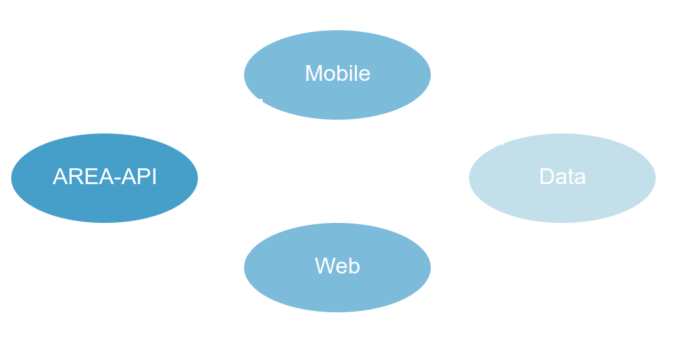
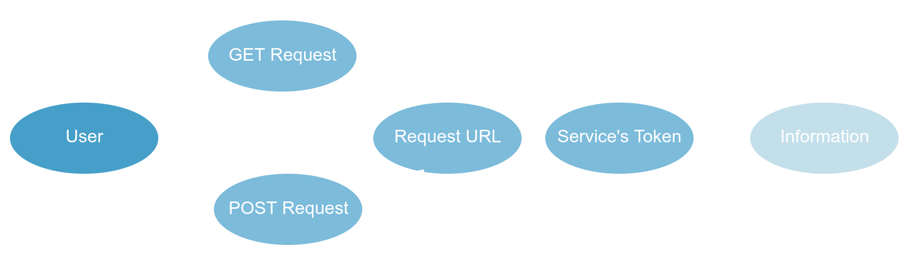

## Action REAction - AREA

<h1>Global knowledges</h1>

- **Number of developpers** : 6
- **Management and sharing tools** : Trello, Discord
- **Langages used** : React.js, Flutter
- **Databases** : Firebase, MongoDB 
- **Compilation** :  Docker

Technical diagram of AREA :

  

Diagram of data handling :

  

## How to launch AREA 

Prerequisite : **Docker**

In `area_mobile` or `area_web`

Command : **docker-compose build && docker-compose up**

